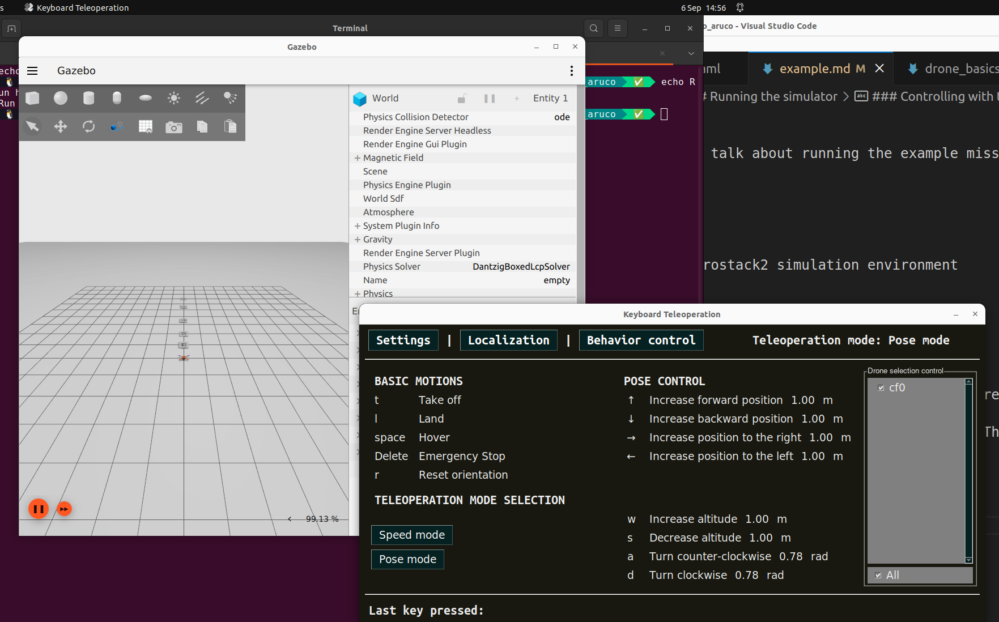
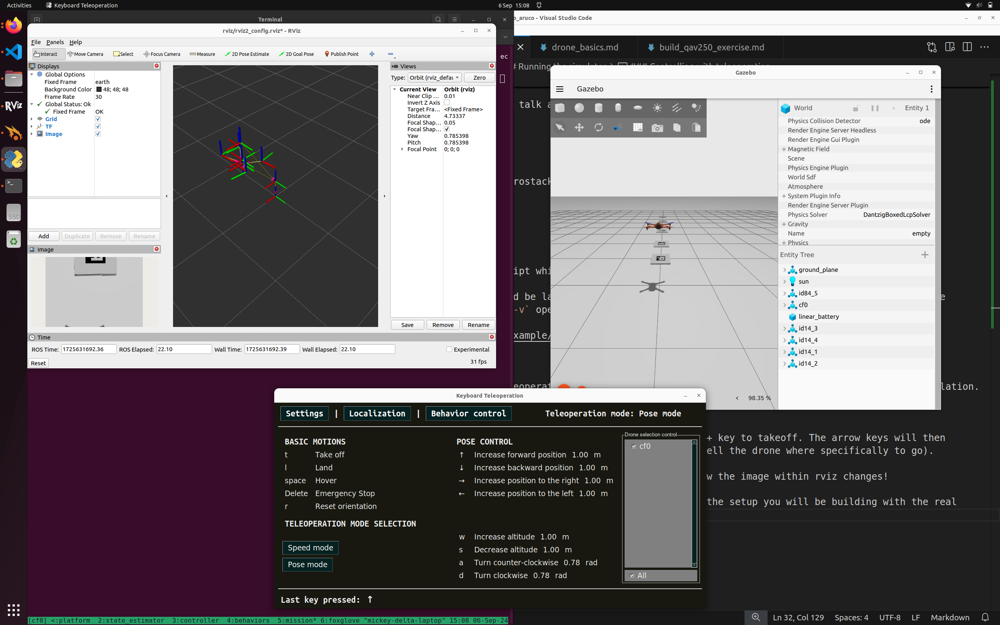

# Example Mission

Following on from the installation, let us talk about running the example mission. 

[TOC]

## Running the simulator

In your selected environment, start the aerostack2 simulation environment 

```
cd /ros2/project_gazebo_aruco
./launch_as2.bash -s -t -v
```

The `launch_as2.bash` file runs a bash script which controls what elements are also started up. 

> The `-s` indicates that the system should be launched in simulation mode. The `-t` opens up the teleoperation remote control window to control the drone. The `-v` opens up a visualisation software called rviz2.


### What does the simulator run

The aerostack simulator runs a number of different modules for ensuring successful flight this includes:

- Platform Interface
- State Estimation
- Motion Controllers
- Behaviour Controllers (Takeoff, Land, Go-To)

You can see the status of these other modules if you select the terminal and press ++ctrl+b++ and then press ++0++ ... ++5++.

> This terminal environment is called `tmux`

### Controlling with teleoperation

Using the `-t` option will open up the teleoperation panel, allowing you to attempt to manually fly the robot in simulation. 



With the teleoperation panel clicked on and selected, you can press the ++t++ key to takeoff. The arrow keys will then control the direction of flight of the drone in position control mode (you tell the drone where specifically to go). 

Notice how the drone flies around in the simulation and in rviz. Also see how the image within rviz changes! 

The image is from a bottom mounted camera on the simulated drone, mirroring the setup you will be building with the real drone. 

Play around a fly the drone around! 



### Running the example autonomous mission

In the original terminal (Use ++ctrl+b++ + ++5++ ), we can run any scripts we want. The `mission_*.py` scripts are some examples of these autonomous missions. 

To run one of these examples, in the terminal type:

```
python3 mission_camera.py
```

This example mission gives you a camera stream from the drone, takes off and arms the drone and flies it around using a few different methods.

Key points is the use of ROS2 to subscribe to the camera topic published by the drone model. Whenever an image is received, it will run the `img_callback` function. 

### Stopping the simulator 

In order to stop the simulator cleanly, in any terminal run the `./stop.bash` script. 

```
./stop.bash
```

This will stop all containers and relevant programs to the simulator in a clean manner. 

Sometimes the simulated drone will go into an unrecoverable state - you may need to resart the simulator. 


## Disecting the controller

Here is the example controller. It is documented! 

```python
#!/bin/python3

"""
CAMERA SAMPLE MISSION

This file is an example mission which reads from the aerostack drone camera and prints it to screen

It also flies around using position and velocity control camera topic 
"""

# Imports
import time
import rclpy
import argparse
from as2_python_api.drone_interface import DroneInterface

from rclpy.qos import qos_profile_sensor_data
from sensor_msgs.msg import Image, CameraInfo

from cv_bridge import CvBridge
import cv2 

######## Drone Control Class ###################
class DroneMotionRef(DroneInterface):
    """Drone Interface
    
    This is the aerostack2 drone interface for connecting to simulated and real drones. 

    It runs as a ROS2 Node which interacts with the currently available ROS2 topics.
    It defines the variables that represent a single drone, i.e.
    - Platform Information
    - Vehicle Pose and Twist (angular velocity)
    - Functions to control the hardware of the drone (arm, disarm, change mode, estop)

    It also contains some modules for flying the drone, this includes:
    - Takeoff, Landing (self.takeoff, self.land)
    - GoTo position control (self.go_to) [https://github.com/aerostack2/aerostack2/blob/main/as2_python_api/as2_python_api/modules/go_to_module.py]
    - FollowPath module (self.follow_path) [https://github.com/aerostack2/aerostack2/blob/main/as2_python_api/as2_python_api/modules/follow_path_module.py]
    
    Other module exist which could be used to. Their interfaces and functions can be referenced most easily in the code. 

    Some Documentation is here: https://aerostack2.github.io/_09_development/_api_documentation/temp_ws/src/as2_python_api/docs/source/as2_python_api.html 
    The Source Code is here: https://github.com/aerostack2/aerostack2/tree/main/as2_python_api 

    Drone Interface Base.py: https://github.com/aerostack2/aerostack2/blob/main/as2_python_api/as2_python_api/drone_interface_base.py 
    Drone Interface.py: https://github.com/aerostack2/aerostack2/blob/main/as2_python_api/as2_python_api/drone_interface.py
    """

    def __init__(self, name, verbose=False, use_sim_time=False):
        super().__init__(name, verbose, use_sim_time)

        # ROS2 create a subscription to the raw image of the sensors.
        # This details the ros message type (Image), the name of the topic
        # And the function that should be called when a message is received on this topic
        self.create_subscription(Image, "sensor_measurements/hd_camera/image_raw", self.img_callback, qos_profile_sensor_data)

        # CV Bridge is a set of functions to convert to and from ROS images to Opencv images
        self.br = CvBridge()

    def img_callback(self, data):
        """Image Callback Function

        The image message is defined here: https://github.com/ros2/common_interfaces/blob/rolling/sensor_msgs/msg/Image.msg 

        Args:
            data (sensor_msgs.msg.Image): The received image message 
        """
        self.get_logger().info('Receiving video frame', once=True) # Log Once

        # Convert the image message to a Opencv image frame
        current_frame = self.br.imgmsg_to_cv2(data)

        # Show the frame in a window
        cv2.imshow("camera", current_frame)   
        cv2.waitKey(1) # Wait a millisecond 

    def run_test(self):
        """ Run the mission """

        # Set the drone to offboard mode. This prepares the drone to receive
        # commands from outside of the flight controller. 
        self.offboard()
        self.get_logger().info("Offboard Mode")

        # Arming the drone powers up the motors to prepare for flight
        self.arm()
        self.get_logger().info("Armed!")

        # Takeoff to 1 meter
        self.get_logger().info("Taking Off!")
        res = self.takeoff(height=1.0, speed=0.5)
        if res:
            self.get_logger().info("Take off complete")
        else:
            self.get_logger().info("Take off Failed, exiting")
            return
        
        # Wait a little bit
        time.sleep(1.0)

        # Position Control fly around a bit
        speed = 1.5
        self.go_to.go_to_point([1, 0, 1.0], speed=speed)
        self.get_logger().info("Point 1")
        self.go_to.go_to_point([2, 0, 2.0], speed=speed)
        self.get_logger().info("Point 2")
        self.go_to.go_to_point([3, 0, 3.0], speed=speed)
        self.get_logger().info("Point 3")
        self.go_to.go_to(3.0, -1.0, 2.5, speed=speed)
        self.get_logger().info("Point 4")
        self.go_to.go_to_point_with_yaw([4, 1, 3.0], angle=45.0, speed=speed)
        self.get_logger().info("Point 5")
        self.go_to.go_to_point_with_yaw([3, -2, 2.0], angle=-45.0, speed=speed)
        self.get_logger().info("Point 6")
        self.go_to.go_to_point_with_yaw([0, 0, 1.0], angle=0.0, speed=speed)
        self.get_logger().info("Point 7")

        self.land()

############# Running the mission and Entrypoint #################################
if __name__ == '__main__':
    parser = argparse.ArgumentParser(
    description="Starts camera mission")
    parser.add_argument('-s', '--simulated',
                        action='store_true', default=False)
    parser.add_argument('-n', '--drone_name', default="cf0")
    args = parser.parse_args()

    if args.simulated:
        print("Mission running in simulation mode")
    else:
        print("Mission running in real mode")

    # Starts ROS2 Node in a script
    rclpy.init()

    # Create the drone object. Connects to the real/simulated drone and runs tests
    uav = DroneMotionRef(args.drone_name, verbose=True)

    # Runs the UAV TEST function
    uav.run_test()

    # Shuts down the UAV
    uav.shutdown()

    # Stop ROS2 Node
    rclpy.shutdown()

    print("Clean exit")
    exit(0)

```


## Modifying the controller

Now try and modify this controller by making it go to different places at different speeds.

This would be a good time to try an automate any computer vision or detection algorithms inside this python script. 

## Transferring this controller

To transfer this controller to real drone, all that is needed is to copy this python mission file to the running machine. 